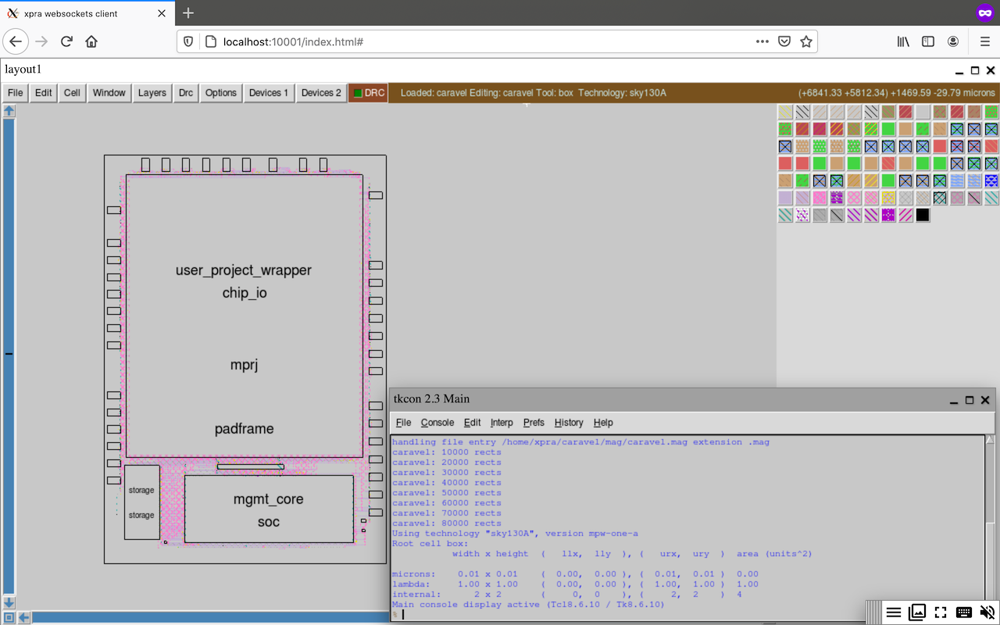

# Rudder

Learn, share and collaborate on ASIC design using open tools and technologies:

 - [skywater-pdk](https://skywater-pdk.readthedocs.io/)
 - [open_pdks](http://www.opencircuitdesign.com/open_pdks/)
 - [caravel](https://github.com/efabless/caravel/)
 - [magic](http://opencircuitdesign.com/magic/)
 - [qflow](http://opencircuitdesign.com/qflow/)
 - [netgen](http://opencircuitdesign.com/netgen/)
 - [openlane](https://github.com/efabless/openlane/)
 - [openroad](https://theopenroadproject.org/)
 - [klayout](https://www.klayout.de/)
 - [xschem](http://repo.hu/projects/xschem/)
 - [gtkwave](http://gtkwave.sourceforge.net/)
 - [yosys](http://www.clifford.at/yosys/)
 - [verilator](https://www.veripool.org/wiki/verilator)
 - [iverilog](http://iverilog.icarus.com/)
 - [padring](https://github.com/YosysHQ/padring)
 - [triton](https://github.com/The-OpenROAD-Project/TritonRoute)
 - [replace](https://github.com/The-OpenROAD-Project/RePlAce)
 - etc.

## Components

### Docker images

 - [0x01be/sdp](https://hub.docker.com/r/0x01be/sdp/)
 - [0x01be/rudder:3d](https://hub.docker.com/r/0x01be/rudder/)
 - [0x01be/openpdks:1.0.89](https://hub.docker.com/r/0x01be/openpdks/) 

### Git repositories

 - [efabless/caravel](https://github.com/efabless/caravel)

## Usage

### Expose the docker [API](https://docs.docker.com/engine/api/v1.41/)

```
docker run --rm -d --name docker -v /var/run/docker.sock:/var/run/docker.sock 0x01be/sdp
```

### Setup [PDK](https://skywater-pdk.readthedocs.io/) and [Harness](https://github.com/efabless/caravel/)

```
docker run --rm -ti --link docker 0x01be/rudder:3d setup
```

It takes up to 10GB of disk space and 20 minutes to download at 2MB/s.

If you already have a harness-derived project, you can specify its repository URL: `docker run --rm -ti --link docker 0x01be/rudder:3d setup https://github.com/hadirkhan10/caravel_ibtida_soc.git`

### Make

```
docker run --rm -ti -v pdk:/opt/pdk -v caravel:/home/xpra/caravel 0x01be/rudder:3d make ship manifest
```

### DRC

```
docker run --rm -ti -v pdk:/opt/pdk -v caravel:/home/xpra/caravel 0x01be/rudder:3d drc
```

### Consistency check

```
docker run --rm -ti -v pdk:/opt/pdk -v caravel:/home/xpra/caravel 0x01be/rudder:3d consistency
```

### [eFabless precheck](https://github.com/efabless/open_mpw_precheck)

```
docker run --rm -ti -v pdk:/opt/pdk -v caravel:/home/xpra/caravel 0x01be/rudder:3d check
```

### Bash

```
docker run --rm -ti --link docker -v pdk:/opt/pdk -v caravel:/home/xpra/caravel 0x01be/rudder:3d bash
```

Or in your browser:

```
docker run --rm -d --name rudder --link docker -p 127.0.0.1:10000:10000 -v pdk:/opt/pdk -v caravel:/home/xpra/caravel 0x01be/rudder:3d
```

Open http://localhost:10000/


### Magic

```
docker run --rm -d --name magic -p 127.0.0.1:10001:10000 -v pdk:/opt/pdk -v caravel:/home/xpra/caravel -e COMMAND=m 0x01be/rudder:3d
```

Open http://localhost:10001/



### KLayout

```
docker run --rm -d --name klayout -p 127.0.0.1:10002:10000 -v pdk:/opt/pdk -v caravel:/home/xpra/caravel -e COMMAND=k 0x01be/rudder:3d
```

Open http://localhost:10002/


You can render GDS2 files in [OpenSCAD](https://www.openscad.org/) or [Blender](https://www.blender.org/) [gds3xtrude](https://github.com/fsitok/gds3xtrude):


### [Geany](https://www.geany.org/)

```
docker run --rm -d --name geany -p 127.0.0.1:10003:10000 -v pdk:/opt/pdk -v caravel:/home/xpra/caravel -e COMMAND=geany 0x01be/rudder:3d
```

Open http://localhost:10003/


### Update

```
docker pull 0x01be/rudder:3d
```

### Uninstall

```
docker stop docker rudder magic klayout geany
docker volume rm pdk caravel
docker rmi 0x01be/sdp 0x01be/rudder:3d 0x01be/openpdks:1.0.89
```

